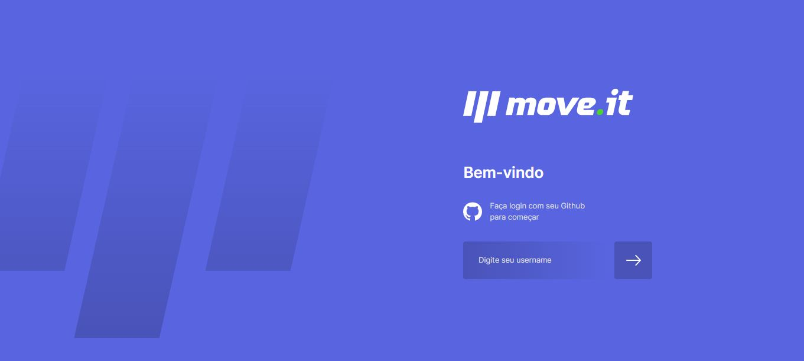
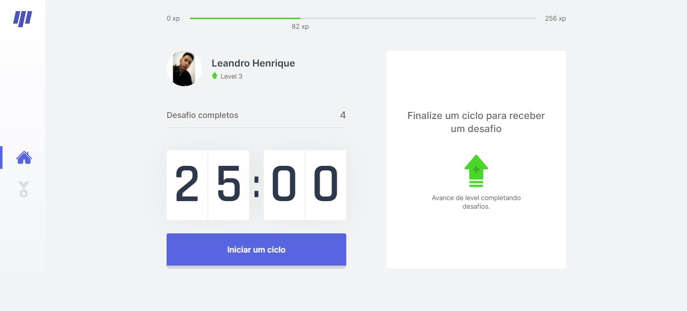
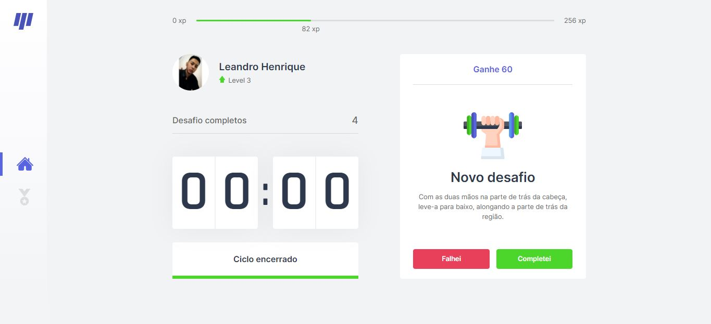
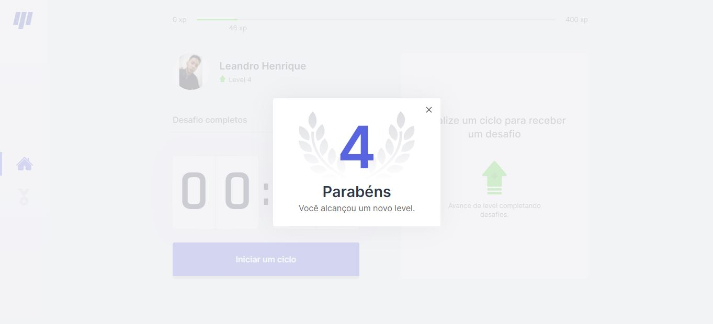

<h1 align="center">
  Move.it
<br />  
  <br /> 
  
<br />
</h1> 
<p align="center"> <strong> Projeto inspirado na técnica do Pomodoro desenvolvido durante a Next Level Week 4.</strong> </p>


<p align="center">
  <a href="https://opensource.org/licenses/MIT">
    
  </a>
</p>

##  :notebook_with_decorative_cover: Sobre
A Next Level Week 4 foi realizada pela Rocketseat com o propósito de criar uma aplicação do zero utilizando next-js e react-js para criar uma aplicação que te ajuda a ter a habilidade de gerenciar o seu tempo e de controlar distrações.
<br />

##  :computer: Tecnologias utilizadas
- ⚛️ **React Js** — Uma biblioteca JavaScript para criar interfaces de usuário
- 💹 **Next Js** — Permite renderização do lado do servidor e geração de sites estáticos para aplicativos da web baseados em React.

## :rocket: Layout
- **Página de Login** 


- **Página Home** 


- **DESAFIOS**


- **LEVEL UP**


## IMPORTANTE:
Baixe todas as dependências utilizadas antes da execução da aplicação
<br />
```npm install ``` : para a instalação das dependências
<br />
```npm run dev``` : executa a aplicação 
